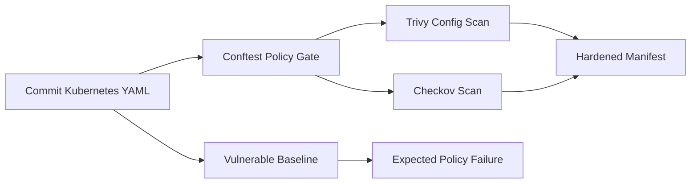

# Kubernetes Policy-as-Code Security Lab

A DevSecOps portfolio project showing how Kubernetes security requirements can be enforced automatically before deployment.

The repository contains two versions of the same workload:

- `k8s/vulnerable/` — intentionally insecure configuration;
- `k8s/hardened/` — remediated configuration designed to satisfy the security policy.

The main idea is simple: insecure Kubernetes YAML should be rejected by CI before it reaches a cluster.

## What this project demonstrates

- Kubernetes workload hardening
- Policy-as-Code with Open Policy Agent / Conftest
- CI security gates in GitHub Actions
- Trivy configuration scanning
- Checkov IaC scanning
- prevention of privileged containers
- non-root execution and disabled privilege escalation
- read-only root filesystem
- dropped Linux capabilities
- resource limits
- seccomp hardening
- NetworkPolicy
- ServiceAccount token hardening
- detection of `latest` images and host-level access

## Flow



## Security rules

The custom policy rejects a workload when it:

1. runs privileged;
2. allows privilege escalation;
3. does not enforce `runAsNonRoot`;
4. has a writable root filesystem;
5. does not drop all Linux capabilities;
6. has no CPU/memory limits;
7. uses the `latest` image tag;
8. has host networking / host PID / host IPC enabled;
9. mounts a `hostPath` volume;
10. does not use a seccomp profile.

## Repository structure

```text
.
├── .github/workflows/security.yml
├── docs/findings.md
├── k8s/
│   ├── vulnerable/
│   │   └── deployment.yaml
│   └── hardened/
│       ├── deployment.yaml
│       ├── namespace.yaml
│       ├── networkpolicy.yaml
│       ├── service.yaml
│       └── serviceaccount.yaml
├── policy/
│   └── kubernetes.rego
├── scripts/
│   └── scan.sh
├── Makefile
└── README.md
```

## Run locally

Requirements: Docker and `make`.

```bash
make policy
make trivy
make checkov
```

To prove that the gate catches the insecure example:

```bash
make vulnerable
```

That command is expected to fail with policy violations.

## Interview explanation

> I created two versions of one Kubernetes workload: intentionally insecure and hardened. I then wrote organization-style OPA policies that enforce runtime hardening requirements. CI proves the vulnerable manifest is rejected and then validates the hardened manifest. Trivy and Checkov provide additional IaC scanning, while the custom policy remains the deterministic security gate.

## Why this matters

Generic scanners are useful, but real organizations also have internal security requirements. Policy-as-Code turns those requirements into repeatable controls that developers receive as feedback during pull requests instead of after deployment.
