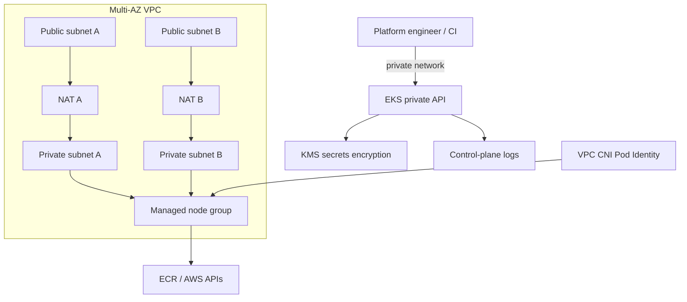

# AWS EKS Production Platform

Production-style Amazon EKS baseline built with Terraform. The goal is to show how a cluster is designed as a platform: networking, identity, encryption, auditability, private access and safe node lifecycle are all defined as code and validated in CI.

## Architecture



## Security and reliability controls

- EKS API endpoint is private only;
- Kubernetes secrets are encrypted with a customer-managed KMS key with rotation enabled;
- API, audit, authenticator, controller-manager and scheduler logs are enabled;
- worker nodes live only in private subnets;
- two Availability Zones and one NAT Gateway per AZ avoid a single egress failure domain;
- cluster administration uses EKS Access Entries instead of a public endpoint or hand-edited `aws-auth`;
- VPC CNI receives its AWS permissions through EKS Pod Identity instead of the node role;
- managed node updates allow only one unavailable node at a time;
- mandatory tags identify environment, owner and managed-by source.

## Validate

```bash
cd terraform
terraform fmt -check -recursive
terraform init -backend=false
terraform validate
cd ..
python3 scripts/security_gate.py
```

CI also runs Checkov and Trivy as IaC review tools. The deterministic `security_gate.py` is the hard gate for the controls this lab promises.

## Deploy

Copy the example variables, set a real IAM principal that will administer the cluster, then review the plan before applying.

```bash
cp terraform/terraform.tfvars.example terraform/terraform.tfvars
cd terraform
terraform init
terraform plan -out=tfplan
terraform apply tfplan
```

This example creates NAT Gateways and other paid AWS resources. It is intended as a production architecture lab, not as a zero-cost sandbox.

## Interview walkthrough

A useful way to explain this project is: the control plane is not exposed to the Internet, secrets use a dedicated KMS key, node IAM permissions are reduced by moving CNI credentials to Pod Identity, and CI checks both Terraform syntax and architecture invariants before a change can be merged.
