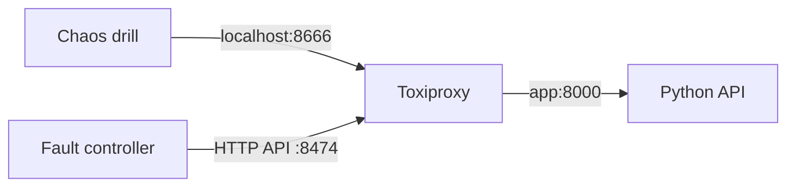

# Chaos Engineering Reliability Lab

A small but real failure-injection lab. Toxiproxy sits between the test client and an API, CI injects network latency, verifies the SLO impact, removes the fault, restarts the backend and proves that the path recovers.

## Architecture



## Experiment

1. Start the API and proxy.
2. Measure a baseline request.
3. Inject 1200 ms downstream latency.
4. Assert the measured request is at least 900 ms slower than baseline.
5. Remove the toxic and assert latency recovers.
6. Restart the backend container.
7. Retry until the proxy path becomes healthy again.
8. Write a JSON experiment report as a CI artifact.

The check compares the fault latency with the measured local baseline instead of assuming a fixed runner speed.

## Run locally

```bash
docker compose up --build -d
python3 scripts/chaos_drill.py
docker compose down -v
```

## Why this matters

Chaos engineering is useful when it tests a hypothesis, not when it randomly breaks things. The hypothesis here is explicit: a network delay must be observable, removable, and the service path must recover after a backend restart without rebuilding the proxy.
