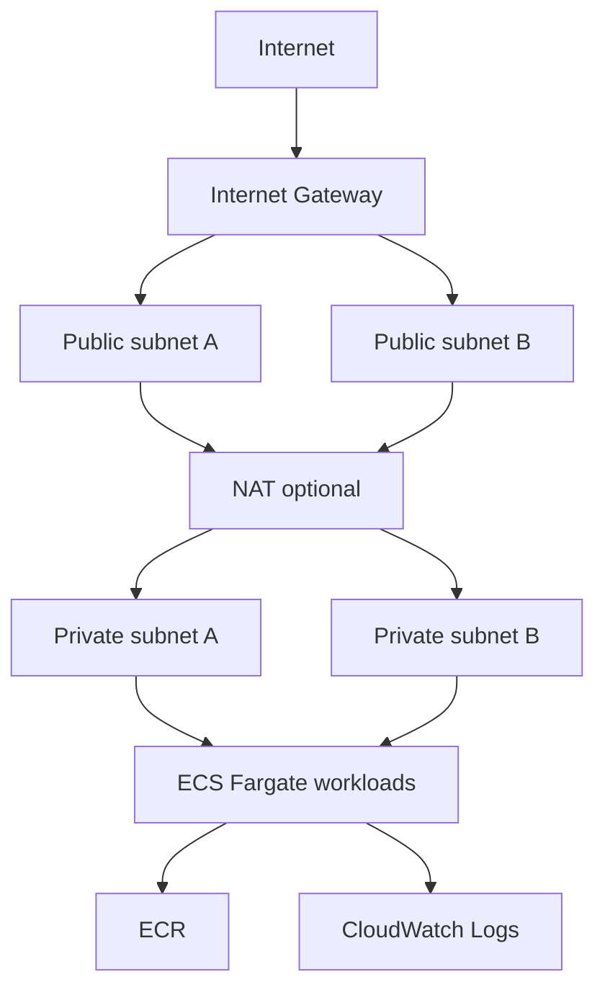

# Cloud Platform on Terraform

A production-style AWS platform baseline built with Terraform. The project focuses on repeatable infrastructure, sane defaults, security controls and CI validation rather than one-off cloud setup.

## What is included

- multi-AZ VPC with public and private subnets;
- Internet Gateway and isolated private route tables;
- optional NAT Gateway for private egress;
- ECR repository with immutable tags and image scanning;
- ECS cluster with Container Insights;
- encrypted CloudWatch log group;
- least-privilege ECS task execution role;
- default encryption and tagging conventions;
- Terraform validation, TFLint, Checkov and Trivy configuration scans;
- separate environment variable files for dev/prod-style usage.

## Architecture



## Safe usage

The default configuration does **not** create a NAT Gateway because that resource incurs hourly cost. Set `enable_nat_gateway = true` only when you intentionally want private-subnet egress.

```bash
terraform init
terraform fmt -check -recursive
terraform validate
terraform plan -var-file=environments/dev.tfvars
```

Do not run `terraform apply` against a real AWS account until you have reviewed the plan and cost impact.

## Interview explanation

> I built a reusable AWS platform baseline instead of provisioning isolated resources. Networking, registry, observability and IAM are managed through Terraform with security defaults. CI performs syntax, style and IaC-security checks before a plan is reviewed. Cost-sensitive resources such as NAT are feature-gated instead of being created by default.
