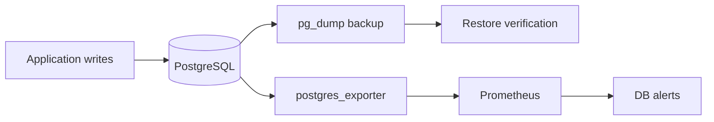

# PostgreSQL Database Reliability Lab

An operations-focused PostgreSQL project covering migrations, backup/restore verification, monitoring and recovery documentation. The important part is proving recovery, not merely claiming that backups exist.

## Stack

- PostgreSQL container with health checks;
- versioned SQL migrations and migration ledger;
- repeatable backup and restore scripts;
- automated restore verification in CI;
- Prometheus PostgreSQL exporter;
- database-specific Prometheus alerts;
- RPO/RTO and incident runbooks.

## Reliability flow



## Start

```bash
cp .env.example .env
docker compose up -d
./scripts/migrate.sh
```

Create and verify a backup:

```bash
./scripts/backup.sh
./scripts/verify_latest_backup.sh
```

## Interview explanation

> I treated backup as a recoverability control rather than a file-generation job. CI boots PostgreSQL, applies versioned migrations, creates data, produces a dump, changes the database and verifies that the backup can restore the expected rows. Monitoring covers availability, connection pressure and transaction behavior, while RPO/RTO assumptions are documented separately.
