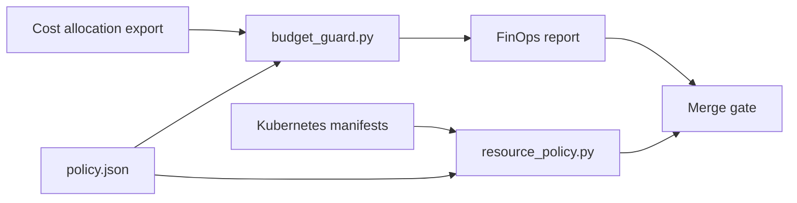

# FinOps Governance Lab

A CI-driven cost-governance project for Kubernetes/platform teams. It does not pretend a static file is a live cloud price list: the sample allocation data represents an exported monthly cost view, while policy defines budgets and engineering rules.

## What CI enforces

- team monthly forecast must remain within its approved budget;
- forecast applies an explicit growth multiplier to observed allocation;
- every Deployment carries `team`, `cost-center` and `environment` labels;
- the same ownership labels are propagated to Pod templates;
- every container defines CPU/memory requests and limits;
- HorizontalPodAutoscaler maximum replica counts stay within a portfolio policy ceiling;
- a Markdown cost report is produced as a CI artifact.

## Flow



## Run

```bash
python3 -m pip install -r requirements-dev.txt
pytest -q
python3 scripts/budget_guard.py
python3 scripts/resource_policy.py
```

Replace `data/allocation.json` with an export from the cost system used by a real organization. The policy and calculation code stay reviewable in Git, while the cost source can change independently.

## Interview walkthrough

The useful discussion is governance, not a made-up savings percentage: ownership labels make allocation possible, requests/limits reduce unallocated capacity ambiguity, forecasts create an early budget signal, and the CI report gives reviewers a concrete decision before deployment.
