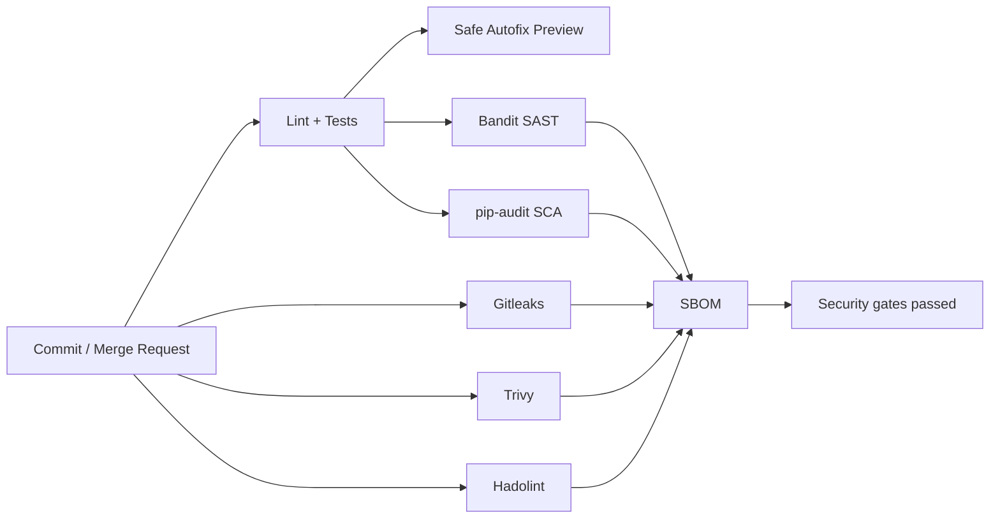

# GitLab Secure Pipeline Lab

A self-contained DevSecOps pet project showing how to move security controls into GitLab CI/CD and keep the feedback close to the developer.

> This folder is stored inside a GitHub portfolio repository. To use the GitLab pipeline directly, copy this folder to the root of a GitLab project so `.gitlab-ci.yml` becomes the project-level pipeline file.

## Pipeline stages



## What is implemented

- Python service with unit tests;
- Ruff linting and formatting checks;
- deterministic autofix preview using only Ruff safe fixes;
- Bandit SAST;
- pip-audit dependency scanning;
- Gitleaks secret detection;
- Trivy vulnerability, secret and misconfiguration scanning;
- Hadolint Dockerfile checks;
- CycloneDX SBOM generation with Syft;
- GitLab CI artifacts for the autofix patch and SBOM;
- a hardened non-root Dockerfile.

## Safe autofix

The `autofix_preview` job runs:

```bash
ruff check --fix-only .
ruff format .
git diff > autofix.patch
```

Ruff applies safe fixes by default. The job exports a patch instead of silently committing changes to the protected branch. This gives the pipeline deterministic remediation without an AI model changing business logic.

## Run locally

```bash
python -m venv .venv
source .venv/bin/activate
pip install -r requirements-dev.txt
ruff check .
ruff format --check .
pytest -q
bandit -r app -q -ll
pip-audit -r requirements.txt
```

On Windows PowerShell activate with:

```powershell
.venv\Scripts\Activate.ps1
```

## Run the service

```bash
python -m app.main
```

Then open `http://127.0.0.1:8080/health`.

## Interview explanation

> I built a GitLab CI pipeline where fast quality checks run first, security scanners run as gates, and an SBOM is produced only after the security stage succeeds. I also added a deterministic autofix job that applies only Ruff's safe fixes and exports a patch artifact instead of letting automation rewrite arbitrary application logic.

## Optional GitLab-native scanners

On GitLab editions where the built-in application-security templates are available, this lab can also be extended with GitLab's SAST, dependency-scanning and secret-detection templates. The default pipeline here deliberately uses portable open-source tools so the project remains understandable and runnable without tying the demonstration to a specific paid tier.
