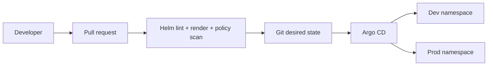

# GitOps Delivery Platform with Argo CD & Helm

A GitOps-oriented delivery project that separates application packaging, environment configuration and deployment reconciliation. The repository is the desired-state source; Argo CD continuously reconciles Kubernetes environments against it.

## What this project demonstrates

- reusable Helm chart for a service;
- separate dev/prod values without duplicating manifests;
- Argo CD ApplicationSet for multi-environment delivery;
- automated manifest rendering and policy checks in CI;
- immutable image-tag convention;
- Kubernetes probes, resource limits, HPA and NetworkPolicy;
- documented promotion and rollback workflow;
- GitOps change flow through pull requests rather than direct cluster mutation.

## Flow



## Layout

```text
gitops-argocd-platform/
├── argocd/applicationset.yaml
├── charts/demo-service/
├── environments/dev/values.yaml
├── environments/prod/values.yaml
├── scripts/render.sh
└── docs/
```

## Render locally

```bash
./scripts/render.sh dev
./scripts/render.sh prod
```

The image value must be an immutable tag (for example a commit SHA or release version), not `latest`.

## Interview explanation

> I designed deployment as a Git reconciliation problem instead of a sequence of imperative kubectl commands. The same Helm chart is rendered with environment-specific values, CI validates the desired state, and Argo CD owns synchronization. Promotion is a reviewed Git change, and rollback is reverting the desired-state commit.
