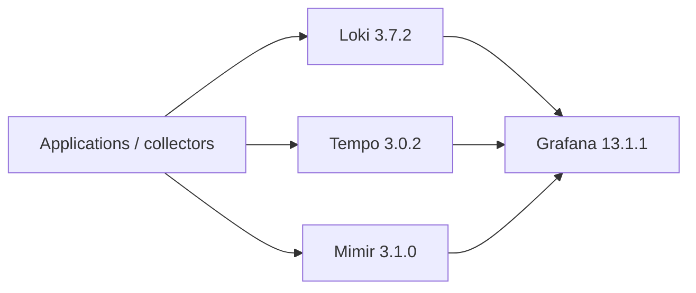

# Grafana LGTM Observability Platform

A local engineering/evaluation platform for the three core telemetry signals: logs in Loki, traces in Tempo, metrics in Mimir, all provisioned into Grafana as code.

The stack intentionally runs the backends in single-process/local-filesystem mode so it can be started and validated in CI. A production deployment would replace local storage with durable object storage, enable authentication/TLS, add tenancy controls and scale components independently where supported.

## Architecture



## What CI proves

- Docker Compose is structurally valid;
- Tempo accepts its configuration in verify-only mode;
- Loki, Tempo, Mimir and Grafana reach their readiness endpoints;
- Grafana starts with all three provisioned data sources;
- a log line can be pushed to Loki and queried back;
- Mimir answers the Prometheus query API;
- a JSON health report is uploaded as an artifact.

## Run locally

```bash
docker compose up -d
python3 scripts/smoke_test.py
```

Open Grafana at `http://localhost:3000` with the local lab credentials `admin` / `admin`.

```bash
docker compose down -v
```

## Production notes

This is a topology/configuration lab, not a production sizing prescription. For production, add an authenticating reverse proxy or another supported auth layer, object storage, retention policies, HA/multi-zone design, backups for configuration state, resource sizing and tenant isolation.
