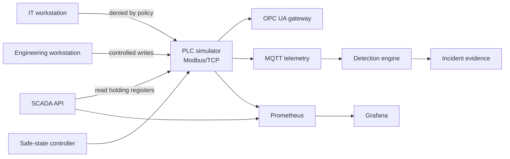

# Industrial Cyber Range

A self-contained OT/ICS security range that models a small pumping process and the systems around it: a PLC-like controller, Modbus/TCP, OPC UA, MQTT telemetry, a SCADA API, segmentation policy, asset inventory, detections, safe-state logic and incident drills.

The range is intentionally designed for local simulation. It must not be pointed at production PLCs, controllers or industrial networks.

## Architecture



The process contains a tank, pump, pressure model and relief valve. The PLC exposes the state as Modbus holding registers. Writes are disabled at the network server by default; controlled write scenarios are executed against the in-process simulator only.

## What is implemented

- deterministic tank/pump/pressure process model;
- PLC register map, controller logic, audit events and safe-state transition;
- minimal Modbus/TCP server and client supporting function codes 3 and 6;
- OPC UA gateway backed by live Modbus reads;
- MQTT telemetry publisher and topic policy;
- SCADA HTTP API and Prometheus metrics;
- OT asset inventory with criticality and zone ownership;
- zone-based allow/deny policy for IT, DMZ, supervisory and control networks;
- detection rules for unauthorized writes, forbidden zone crossings, unknown OPC UA clients, unexpected MQTT topics and unsafe pressure;
- incident drills that generate structured evidence without touching external systems;
- Docker Compose topology with local-only management bindings and internal OT networks.

## Quick start

```bash
python -m venv .venv
. .venv/bin/activate
pip install -r requirements-dev.txt
pytest -q
python scripts/validate_architecture.py
python scripts/modbus_smoke.py
python scripts/opcua_smoke.py
```

The main Compose topology keeps MQTT inside the simulated OT networks. A separate smoke topology exposes only the broker on loopback so a local client can prove a real MQTT round trip without weakening the primary segmentation model:

```bash
docker compose -f docker-compose.smoke.yml up -d mqtt
python scripts/mqtt_smoke.py
docker compose -f docker-compose.smoke.yml down -v
```

Run a controlled incident drill:

```bash
python scripts/incident_drill.py --scenario unauthorized-modbus-write
python scripts/incident_drill.py --scenario high-pressure
```

Generated evidence is written under `artifacts/` and is ignored by Git.

## Register map

| Address | Name | Access | Encoding |
|---|---|---|---|
| 0 | tank level | read | percent × 10 |
| 1 | pressure | read | bar × 100 |
| 10 | pump speed | write | percent |
| 11 | relief valve | write | 0/1 |
| 12 | safe state | read | 0/1 |

The network Modbus server starts in read-only mode unless `OTLAB_ALLOW_MODBUS_WRITES=1` is explicitly set. Even in write-enabled mode, the simulator validates register ranges and keeps the process inside modeled safety boundaries.

## Safety model

The safe-state controller activates when pressure reaches 5.5 bar or tank level reaches 92%. It reduces the pump to 10%, opens the relief valve and marks the process as being in safe state. The action is deterministic and tested as a regression contract.

## Documentation

- [`docs/architecture.md`](docs/architecture.md) — component and trust-boundary design;
- [`docs/protocols.md`](docs/protocols.md) — Modbus, OPC UA and MQTT mapping;
- [`docs/threat-model.md`](docs/threat-model.md) — assets, trust assumptions and abuse cases;
- [`docs/incident-response.md`](docs/incident-response.md) — evidence and response flow;
- [`docs/runbook.md`](docs/runbook.md) — operating and troubleshooting the range;
- [`docs/adr-001-safe-state.md`](docs/adr-001-safe-state.md) — safe-state design decision.

## Boundaries

This repository contains only a simulator and defensive validation logic. The incident scenarios use synthetic asset identities and local process state. No discovery, scanning or write logic targets external industrial equipment.
