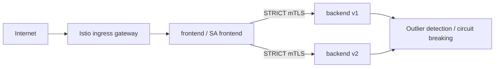

# Istio Service Mesh Security

A service-mesh lab focused on zero-trust service-to-service traffic rather than simply installing a sidecar. It models strict mTLS, workload identity authorization, resilient routing and controlled ingress/egress behavior.

## Architecture



## Controls demonstrated

- namespace-wide `PeerAuthentication` with `STRICT` mTLS;
- backend `AuthorizationPolicy` that accepts only the frontend service account identity;
- dedicated Kubernetes ServiceAccounts instead of namespace-wide identity;
- canary routing between backend v1 and v2;
- request timeout, bounded retries and retry conditions;
- connection-pool limits and outlier ejection;
- Sidecar egress scope restricted to the application namespace and `istio-system`;
- hardened pod security contexts and resource limits.

## Validate

```bash
python3 -m pip install pyyaml
python3 scripts/assert_security.py
docker run --rm -v "$PWD:/work" istio/istioctl:1.30.3 analyze --use-kube=false -f /work/manifests
```

## What to discuss in an interview

The important point is that mTLS is only the transport foundation. The backend also authorizes the caller by SPIFFE workload identity. Traffic policy limits retry storms and ejects unhealthy endpoints, while the virtual service makes canary rollout explicit and reviewable.
