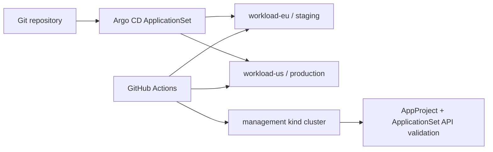

# Multi-Cluster GitOps Platform

A platform-engineering lab for operating one GitOps control plane across multiple Kubernetes workload clusters.

## What this project demonstrates

- Argo CD `AppProject` boundaries for repository and destination allow-lists;
- `ApplicationSet` fan-out to two workload clusters;
- environment-specific Kustomize overlays;
- automated prune/self-heal semantics and server-side apply;
- explicit staging/production placement;
- multi-cluster desired-state rendering;
- drift injection and deterministic reconciliation in real Kubernetes clusters;
- CI validation of Argo CD CRDs against a management-cluster API server.

## Architecture



The CI drill intentionally does **not** fake a green result with YAML parsing only. It creates three real kind clusters. The management cluster installs the Argo CD CRDs and server-side validates the platform resources. The two workload clusters receive rendered Kustomize state, are deliberately drifted, and are then reconciled back to Git state.

A full Argo CD controller installation is omitted from CI to keep the lab deterministic and reasonably fast; the repository still contains controller-ready `AppProject` and `ApplicationSet` resources.

## Repository layout

```text
multi-cluster-gitops/
├── argocd/
│   ├── appproject.yaml
│   └── applicationset.yaml
├── apps/demo/
│   ├── base/
│   └── overlays/{eu,us}/
└── scripts/
    ├── validate_platform.py
    └── drift_drill.sh
```

## Security and reliability decisions

1. The Argo project only trusts this portfolio repository.
2. Deployments are restricted to the `payments` namespace in the named workload clusters.
3. Namespace-scoped resources are allowed while high-risk cluster-scoped resources are not delegated to application teams.
4. Automated sync specifies both `prune` and `selfHeal`.
5. Kustomize workloads run as non-root with a read-only filesystem and dropped Linux capabilities.
6. Production and staging have separate overlays and replica policy.
7. CI injects unauthorized replica/image changes and proves that desired state wins.

## Local validation

```bash
python3 -m pip install pyyaml
python3 scripts/validate_platform.py
kubectl kustomize apps/demo/overlays/eu
kubectl kustomize apps/demo/overlays/us
```

## Interview walkthrough

A useful explanation is: *the management plane defines where applications are allowed to deploy, ApplicationSet turns cluster metadata into Applications, Kustomize keeps environment differences reviewable, and CI proves both the Argo API objects and the convergence behavior on multiple real clusters.*
