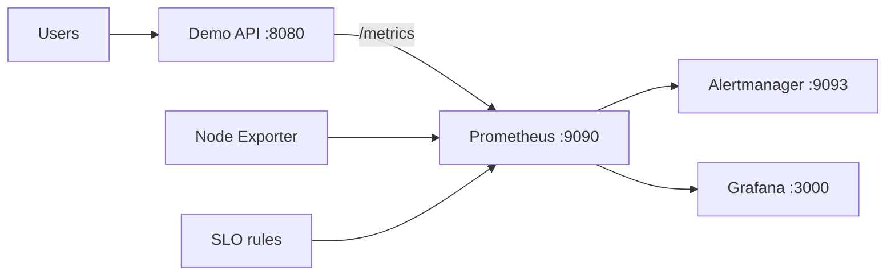

# Observability & SRE Stack

A local SRE lab that turns a small HTTP service into an observable system with metrics, dashboards, alerting, SLOs and incident runbooks.

## Stack

- Python/Flask demo service instrumented with Prometheus metrics;
- Prometheus for scraping and recording rules;
- Alertmanager for routing alerts;
- Grafana with provisioned datasource and dashboard;
- Node Exporter for host/container runtime signals;
- Docker Compose for one-command startup;
- SLO and incident-response documentation.

## Architecture



## Start

```bash
docker compose up --build -d
```

Open:

- service: `http://localhost:8080/`
- Prometheus: `http://localhost:9090/`
- Alertmanager: `http://localhost:9093/`
- Grafana: `http://localhost:3000/` (`admin` / `admin` for the local lab only)

Generate traffic:

```bash
./scripts/load.sh
```

The application exposes request count, latency histograms, in-flight requests and error counters. Prometheus derives availability/error-rate signals and fires alerts when the demo SLO is violated.

## What to discuss in an interview

> I built the monitoring around service-level objectives rather than only infrastructure graphs. The application exports RED metrics, Prometheus records availability/error-rate signals, Alertmanager handles actionable alerts, and every important alert links to a runbook. Grafana is fully provisioned from Git so dashboards are reproducible.
