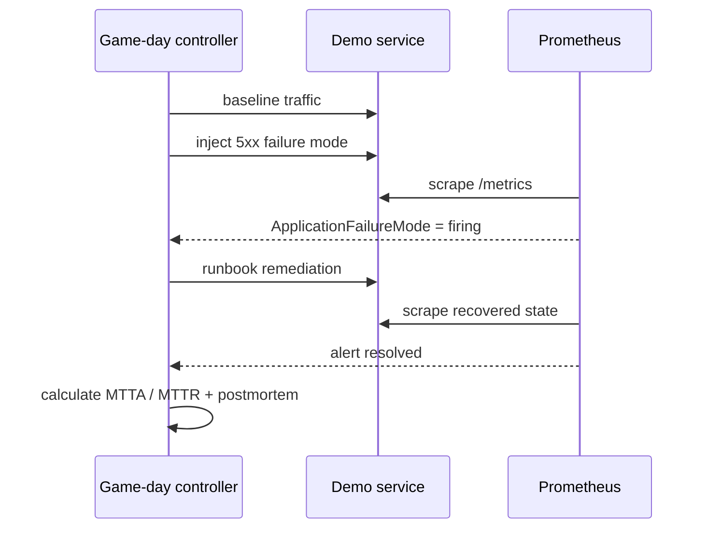

# SRE Incident Response Game Day

An automated incident-response exercise that turns observability and runbooks into executable reliability evidence.

## Scenario

The demo service starts healthy. CI generates baseline traffic, switches the runtime into a deterministic 5xx failure mode, waits until Prometheus produces a paging alert, applies the documented remediation, verifies alert recovery and then generates a timestamped incident timeline and postmortem.



## What is tested

- real Docker Compose startup and health;
- Prometheus configuration and alert rules;
- real metric scraping at one-second intervals;
- a deterministic paging condition with a `for` window;
- incident detection through the Prometheus HTTP API;
- runbook-driven remediation;
- verification that the alert actually resolves;
- automatically generated timeline, MTTA, MTTR and postmortem evidence.

## Files

```text
sre-incident-game-day/
├── app/
│   ├── app.py
│   └── Dockerfile
├── prometheus/
│   ├── prometheus.yml
│   └── alerts.yml
├── runbooks/high-error-rate.md
├── scripts/
│   ├── game_day.py
│   └── validate.py
└── docker-compose.yml
```

## Run locally

```bash
cd sre-incident-game-day
mkdir -p runtime artifacts
echo healthy > runtime/mode
docker compose up -d --build
python3 scripts/game_day.py
docker compose down -v
```

## Evidence

A successful exercise writes:

- `artifacts/incident-timeline.json` — machine-readable timestamps and response metrics;
- `artifacts/postmortem.md` — a concise human-readable incident review.

## Interview walkthrough

This project demonstrates the SRE loop end to end: *define a signal, alert on it, inject a controlled failure, detect it, execute a runbook, prove recovery, and preserve incident evidence*. The useful part is that MTTA/MTTR are calculated from a real automated exercise rather than written down as hypothetical targets.
